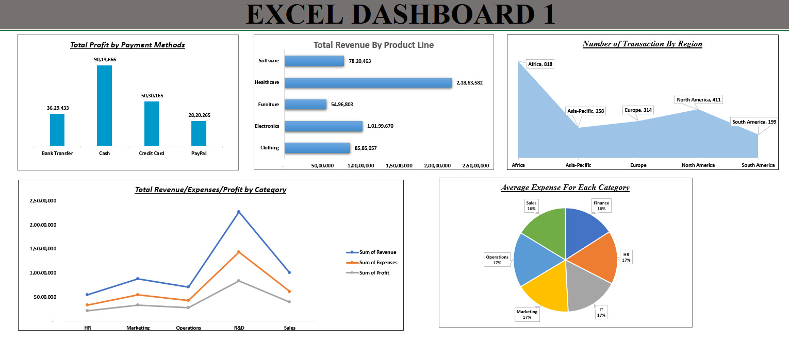

# 📊 Business Insights Dashboard - Excel Visualization

## 🗂️ File
`Excel_Dashboard_1.xlsx`

## 📌 Project Overview
This Excel dashboard presents a clean and insightful view of key business performance indicators including profits, revenue, expenses, and transaction volumes. It is ideal for stakeholders seeking a quick and visual understanding of organizational metrics.

---

## 📈 Dashboard Sections

### 1. Total Profit by Payment Methods
- **Type:** Vertical Bar Chart  
- **Insight:** Highlights profit distribution across payment methods such as Cash, Credit Card, PayPal, etc.

### 2. Total Revenue by Product Line
- **Type:** Horizontal Bar Chart  
- **Insight:** Compares total revenue from different product lines like Healthcare, Electronics, Furniture, etc.

### 3. Number of Transactions by Region
- **Type:** Area Chart  
- **Insight:** Shows transaction counts across different global regions.

### 4. Total Revenue / Expenses / Profit by Category
- **Type:** Line Chart  
- **Insight:** Visual comparison of financial performance (revenue, expenses, and profit) across departments like Sales, HR, R&D, etc.

### 5. Average Expense by Category
- **Type:** Pie Chart  
- **Insight:** Breakdown of average expenses by business function.

---

## 🛠️ How to Use
1. Open the file in **Microsoft Excel** (or any compatible spreadsheet tool).
2. Review the dashboards for summarized insights.
3. To analyze updated data, replace or extend the existing dataset.

---

